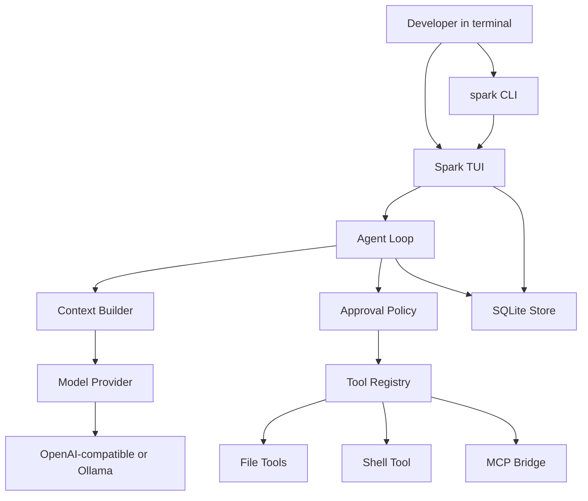
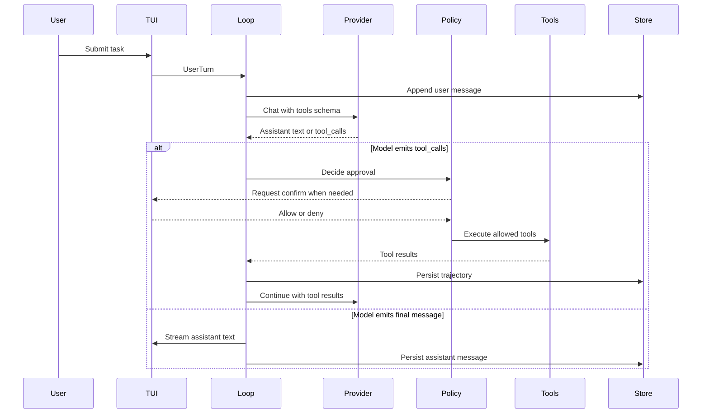

# 架构设计

## 系统概述

Spark 是单进程本地 Agent。TUI 收集用户输入，Core 维护一轮 Agent Loop，Provider 对接大模型，Tools 在工作目录执行副作用，Policy 决定是否拦截，Store 把会话落到 SQLite。

官方 Codex CLI 的核心也是同一条循环（见 OpenAI《Unrolling the Codex agent loop》）：用户指令进 prompt → 推理 → 工具调用则执行并回填 → 直到模型给出最终文本。Spark 复用这条循环，去掉 ChatGPT 登录、云端任务、Guardian 与 IDE/桌面矩阵，把第一版收束到「终端里能干活的自托管 Agent」。

## 技术栈

- Python 3.11+
- Textual：全屏 TUI（对话流、diff 预览、审批面板、状态栏）
- Typer：CLI
- httpx + OpenAI Python SDK：流式 Chat Completions
- pydantic v2 / pydantic-settings：配置与工具参数校验
- SQLite（标准库 `sqlite3`）：会话、消息、工具轨迹
- mcp（官方 Python SDK）：MCP 客户端
- pytest + pytest-asyncio：循环与工具测试

## 项目结构（建议）

```text
spark/
  pyproject.toml
  README.md
  src/spark/
    __init__.py
    cli.py                 # Typer 入口：spark / spark exec
    config.py              # 加载 ~/.spark/config.toml 与环境变量
    tui/
      app.py               # Textual App
      chat.py              # 对话与流式输出
      approval.py          # 审批弹层
      diff_view.py         # 文件补丁预览
    core/
      loop.py              # Agent Loop
      context.py           # 消息组装、截断、AGENTS.md 注入
      session.py           # 会话生命周期
    providers/
      base.py              # Provider 协议
      openai_compat.py     # OpenAI 兼容
      ollama.py            # 本地 Ollama
    tools/
      registry.py          # 工具注册与 schema
      fs.py                # read / write / list / apply_patch
      shell.py             # 受工作区约束的命令执行
      mcp_bridge.py        # MCP 工具适配
    policy/
      approval.py          # Suggest / AutoEdit / FullAuto
      sandbox.py           # 工作区边界、超时、禁止路径
    store/
      db.py                # SQLite schema 与访问
      sessions.py          # 列出 / 恢复 / 追加
    prompts/
      system.md            # 系统提示词模板
  tests/
  examples/
```

仓库根目录（`当前工作区`）同时保留 `.monkeycode/` 规划文档，以及只读对照用的 `codex/` 克隆。Spark 运行时不 import Codex。

## 核心模块/组件

| 模块 | 职责 |
|------|------|
| CLI | 解析子命令、工作目录、审批模式、resume id，拉起 TUI 或一次性 `exec` |
| TUI | 渲染对话、流式 token、工具状态、diff、审批选择 |
| Core Loop | 驱动「请求模型 → 解析 tool_calls → 执行 → 追加 → 再请求」 |
| Context | 系统提示、AGENTS.md、历史消息、工具结果的有界组装 |
| Provider | 把统一的 `ChatRequest` 变成具体 HTTP 调用，返回流式增量或完整 message |
| Tools | 把模型函数调用变成对工作区的实际操作 |
| Policy | 审批模式、路径白名单、命令超时、危险命令确认 |
| Store | 会话持久化，支持恢复与导出 |
| MCP Bridge | 启动外部 MCP 进程，把 tools/list 与 tools/call 映射进 Registry |

## 架构图



## 关键流程

### Agent Loop



### 审批决策

1. 工具属于只读（`read_file`、`list_dir`）：三种模式都直接执行
2. 工具属于写文件（`write_file`、`apply_patch`）：Suggest 弹出 diff 待确认；Auto Edit / Full Auto 直接执行
3. 工具属于 shell：Suggest / Auto Edit 弹出命令与工作目录待确认；Full Auto 在沙箱约束内直接执行
4. MCP 工具默认按「可能有副作用」处理，与 shell 同一级审批，配置可为单个 MCP 工具声明只读

### 上下文组装顺序

1. 系统提示（角色、工作区根、工具使用约定）
2. 项目 `AGENTS.md`（若存在，截断到上限）
3. 会话历史（从 SQLite 读，超出 token 预算时从最旧非系统消息截断）
4. 本轮用户输入
5. 本轮已发生的 tool 结果

单条注入片段有硬上限（默认 8K 字符）；整体对话有预算（默认约 32K tokens 的字符近似）。超限时保留系统提示与最近 N 轮。

## 设计决策

| 决策 | 选择 | 理由 |
|------|------|------|
| 语言 | Python | 第一版要尽快跑通循环与 TUI；Rust 对齐官方仓库会把交付拖成重写 Codex |
| 模型协议 | Chat Completions + function calling | 兼容面最广；后续可加 Responses API 适配器而不改 Loop |
| 不 fork Codex | 对照架构、独立实现 | 官方仓库 100+ crate，绑登录/云端/Guardian；独立实现才能「自己的 Agent」 |
| 密钥 | 环境变量与本地 TOML | 变量名面向用户项目（`SPARK_API_KEY` 等），运行环境平台 Key 不写入项目 |
| 存储 | SQLite 单文件 | `~/.spark/sessions.db`，备份即复制文件 |
| 审批默认 | Suggest | 第一次使用以确认流建立信任，配置可改默认模式 |
| MCP | stdio 客户端 | 与 Cursor/Codex 生态同一协议，扩展面不进内核 |
| 第一版不做 | IDE 插件、云端任务、多 Agent 并行、计算机使用 | 先把单会话终端循环做稳 |
