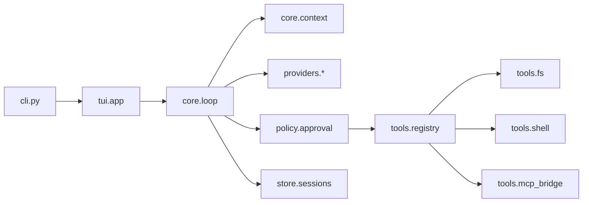

# Spark Coding Agent

Feature Name: spark-coding-agent
Updated: 2026-09-21

## Description

Spark is a Python terminal coding agent. The first shippable product is a TUI that runs Codex-style Agent Loop locally: stream a model, execute file and shell tools under approval policy, persist sessions, inject `AGENTS.md`, and optionally bridge MCP servers. Model access is OpenAI-compatible HTTP or Ollama. Vendor login and cloud agent services are out of scope.

## Architecture

Spark is a single local process. The TUI and CLI are thin event sources. `core.loop` is the only orchestrator. Providers, tools, policy, and store are replaceable modules behind narrow interfaces.



Codex CLI (cloned at `当前工作区/codex`) is an architecture reference only. Spark does not depend on `codex-rs` crates, ChatGPT auth, or Codex config.

## Components and Interfaces

### CLI (`spark.cli`)

Typer application. Responsibilities: parse Workdir, approval, provider, config path; create `AppState`; launch Textual or run `exec`.

### TUI (`spark.tui`)

Textual app with three surfaces:

- Conversation log consuming `TurnEvent`
- Composer emitting `UserTurn`
- Modal approval emitting `ApprovalDecision`

TUI never calls tools or HTTP directly.

### Agent Loop (`spark.core.loop`)

Input: `UserTurn`. Output: async stream of `TurnEvent` (`text_delta`, `tool_start`, `tool_end`, `approval_needed`, `turn_end`, `turn_error`).

Loop steps:

1. Append user message to Store and Context
2. Call `Provider.stream`
3. If `tool_calls`, run Policy then Registry, append tool messages, goto 2
4. If final text, persist and emit `turn_end`
5. Stop on cancel, provider error, or `max_tool_rounds`

### Context (`spark.core.context`)

Builds the `messages` array. Order: system prompt, `AGENTS.md` fragment, truncated history, current turn. Enforces `max_fragment_chars` and `history_budget_chars`.

### Providers (`spark.providers`)

Protocol:

```python
class Provider(Protocol):
    def stream(
        self, messages: list[ChatMessage], tools: list[ToolSchema]
    ) -> AsyncIterator[ChatDelta]: ...
```

Implementations: `OpenAICompatProvider`, `OllamaProvider`, `MockProvider`.

### Tools (`spark.tools`)

Each tool is a pydantic args model plus `execute(ctx, args) -> ToolResult`. Registry exposes OpenAI function schemas. `apply_patch` uses exact unique substring replace.

### Policy (`spark.policy`)

Pure function `decide(mode, tool_name, args) -> Allow | Prompt | Deny`. Prompt events pause the loop until TUI returns a decision. Session-level allow-always is a set of tool names on `SessionState`.

### Store (`spark.store`)

SQLite file `~/.spark/sessions.db`. Schema: `sessions`, `messages`, `tool_events`. Resume reconstructs Context from `messages` rows in id order.

### MCP Bridge (`spark.tools.mcp_bridge`)

Starts configured stdio servers, namespaces tools as `mcp__{server}__{tool}`, forwards calls. Failed servers are removed from the live registry.

## Data Models

```python
class SparkConfig(BaseModel):
    provider: ProviderConfig
    agent: AgentConfig
    context: ContextConfig
    mcp_servers: list[McpServerConfig]

class ProviderConfig(BaseModel):
    name: Literal["openai_compat", "ollama", "mock"]
    base_url: str
    model: str
    api_key_env: str = "SPARK_API_KEY"

class AgentConfig(BaseModel):
    approval: Literal["suggest", "auto-edit", "full-auto"]
    workdir_only: bool = True
    shell_timeout_sec: int = 60
    max_tool_rounds: int = 30

class Session(BaseModel):
    id: str
    workdir: str
    model: str
    created_at: int
    updated_at: int
    title: str

class ChatMessage(BaseModel):
    role: Literal["system", "user", "assistant", "tool"]
    content: str | None = None
    tool_calls: list[ToolCall] | None = None
    tool_call_id: str | None = None

class ToolCall(BaseModel):
    id: str
    name: str
    arguments: dict

class ToolResult(BaseModel):
    ok: bool
    payload: dict

class ApprovalDecision(BaseModel):
    tool_call_id: str
    action: Literal["allow", "deny", "allow_always"]
```

Timestamps are Unix seconds (`i64` equivalent: Python `int`).

## Correctness Properties

- Every tool filesystem path is resolved with `Path.resolve()` and must be equal to Workdir or a descendant
- `apply_patch` mutates a file only when `old_text` occurs exactly once
- Agent Loop makes progress: each tool round either appends a tool result or terminates the turn
- Context assembly is additive per turn; history is truncated from the oldest non-system message, never rewritten in the store
- A single injected fragment stays at or under `max_fragment_chars`
- Mock provider performs zero outbound HTTP
- Secrets never appear in config templates, logs at INFO, or TUI status

## Error Handling

| Scenario | Handling |
|----------|----------|
| Missing `SPARK_API_KEY` for openai_compat | Exit code 2 before TUI starts, message names the env var |
| Provider HTTP/stream failure | Emit `turn_error`, persist error message, leave session resumable |
| Tool path outside Workdir | ToolResult error, loop continues |
| Patch match count != 1 | File unchanged, ToolResult error |
| Shell timeout | Kill process group, ToolResult timeout |
| Approval denied | ToolResult denial, loop continues |
| `max_tool_rounds` | Stop loop, TUI error, session saved |
| MCP handshake failure | Drop that server, TUI warning, other tools remain |
| Unknown resume id | Exit code 2 |
| `spark exec` with suggest | Exit code 2 |

User-visible errors are one short sentence plus an optional detail field. Stack traces go to `~/.spark/spark.log`.

## Test Strategy

Framework: pytest, pytest-asyncio, tmp_path fixtures.

Must-have integration coverage (Requirement mapping):

1. Loop: mock provider returns tool_call then final text; assert two provider calls and persisted tool result
2. Loop: `max_tool_rounds` stops the turn
3. Tools: read/write/list inside tmp workdir
4. Tools: path traversal (`../`) rejected
5. Tools: apply_patch unique match vs 0 vs 2 matches
6. Tools: shell timeout
7. Policy: suggest prompts on write and shell; auto-edit prompts only on shell; full-auto prompts never for builtin tools
8. Policy: deny returns payload and loop continues
9. Provider: missing key raises config error for openai_compat
10. Store: resume restores message order
11. Context: AGENTS.md injected and truncated
12. Exec: suggest mode exits 2
13. MCP: namespaced tool forwarded; dead server dropped

TUI coverage: Textual pilot for approval Allow/Deny. Snapshot optional for status bar text.

## References

[^1]: (Website) - [Unrolling the Codex agent loop](https://openai.com/index/unrolling-the-codex-agent-loop/)
[^2]: (Website) - [OpenAI Codex repository](https://github.com/openai/codex)
[^3]: (Local clone) - `当前工作区/codex` Codex CLI source used as architecture reference
