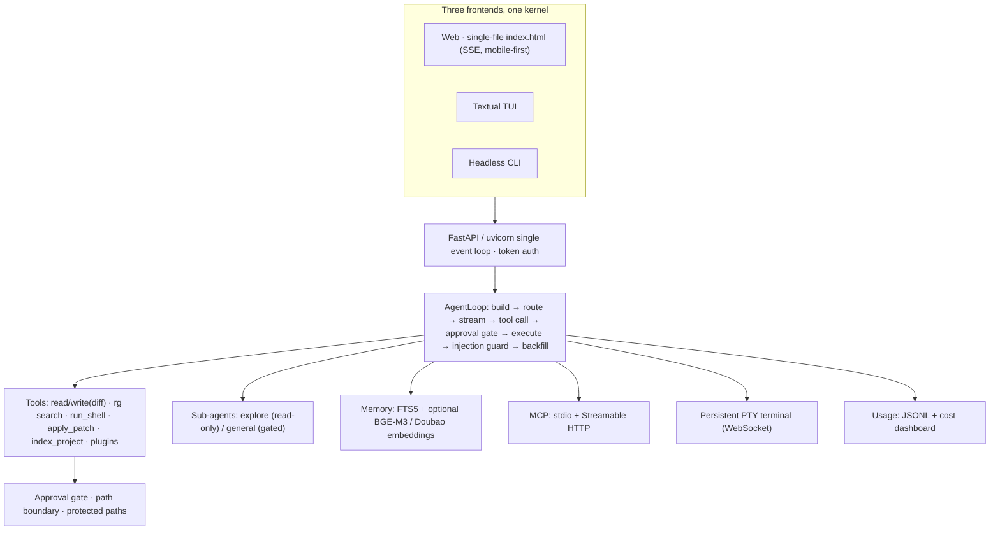

<div align="center">

# ⚡ Spark

**The local AI coding agent that asks before it acts.**

Runs on your machine · Sees every step · Approves every write & command · Zero hidden AI calls

[](LICENSE)
[]()
[]()
[]()

**English** · [中文](README.zh.md)

</div>

---

Spark is a **local-first AI coding agent** rebuilt from the ground up — no Electron bloat, no cloud dependency, no hidden model calls. It protects you with an **approval gate** (nothing writes to disk or runs commands without your say-so), blocks **prompt injection**, remembers your project **locally**, and works with **Chinese model providers out of the box** (DeepSeek / Qwen / Zhipu / Kimi / Doubao / Ollama).

One file frontend. One process. One `pip install`. Everything lives under `~/.spark2/`.

> ✨ **Stand-out vs. other AI agents:** opencode, ZCode and Codex CLI all ship without built-in prompt-injection defense and cross-session semantic memory. Spark ships **both** — plus a lightweight plugin point, local code indexing and a cost dashboard.

---

## 🎬 See it in action

[Watch the demo video](docs/media/promo.mp4)

## ✨ Why Spark?

| | Spark | Typical AI agent |
|---|---|---|
| 🛡️ **Approval gate** | Writes & commands **always ask first** (3 modes, path-boundary enforced) | Auto-edits silently |
| 🧠 **Prompt-injection defense** | Tool/file output treated as *data, never instructions* — flagged inline | Usually none |
| 🔒 **Local semantic memory** | FTS5 zero-dep + optional Doubao/BGE-M3 embeddings, per-workdir, **zero hidden calls** | Cloud memory or none |
| 🇨🇳 **Chinese models first** | DeepSeek / Qwen / Zhipu / Kimi / Doubao / Ollama presets, 2026 current models | OpenAI-centric |
| 🪶 **Lightweight** | Single-file web UI + one uvicorn process, no Electron | Heavy desktop shells |
| 🧩 **Extensible** | Plugins = `.py` files you drop in `~/.spark2/plugins/` | Rigid or SDK-heavy |

## 🚀 Quick start

```bash
cd spark2
pip install -e ".[dev]"
spark2 web          # opens the printed URL (loopback only)
```

1. Open **Settings** → pick a provider (DeepSeek / Qwen / Zhipu / Kimi / Doubao / Ollama / **demo mode**) → paste your API key → point **workdir** at your project → **Save**.
2. Click **+ New session** and tell Spark what to do — *"fix the login endpoint bug"*.
3. Watch every step: plan → tool call → diff preview → **you approve** → result.

**No API key?** Switch the provider to *Demo mode* — the full interaction (plan cards, tool cards, approval popups) works with zero config.

**Headless:** `spark2 run "refactor lib.py" --workdir /path/to/project`
**Terminal UI:** `spark2 tui` — same kernel, keyboard-first (Ctrl+N new / Ctrl+S sessions / A allow / D deny / S always allow)
**Health check:** `spark2 doctor` — environment, config, MCP, memory, logs in one pass

## 🧰 What's inside (v0.8.0)

- 🛡️ **Approval gate** — suggest / auto-edit / full-auto; protected paths are always refused; writes outside workdir always confirmed; session-scoped "always allow"
- 🧠 **Prompt-injection defense** — every tool/file result is untrusted data; CN/EN injection patterns flagged with an inline banner; permissions always stay with the gate
- 📦 **Multi-file edits (`apply_patch`)** — one unified diff across many files, grouped per-file diff review (expand/collapse), all-or-nothing apply, git checkpoint rollback
- 🖥️ **Built-in persistent terminal (PTY)** — xterm.js panel, cwd = workdir, survives fold/refresh, multi-tab, take over input anytime (WebSocket, token-auth)
- 👥 **Multi-agent (`spawn_subagent`)** — `explore` read-only scout, `general` full-tool executor that *still goes through the approval gate*; events embedded in the main stream; shared cancel
- 🍴 **Session fork & parallel runs** — copy a session at any point into an independent branch; run many sessions concurrently with live "● running" badges
- 🔎 **Code index** — `index_project` / `search_symbol` / `lint_file`: Python via stdlib `ast` (symbols + line numbers), other languages line-level; cached per-workdir, mtime+size invalidation, read-only
- 🧩 **Lightweight plugins** — drop a `.py` into `~/.spark2/plugins/` (`tools=` list or `register(reg)`); plugin tools respect the approval gate; failures never break the server
- 💰 **Cost dashboard** — per-session token/fee JSONL; top bar "Usage" panel with session ranking; 2026-09 verified official pricing (DeepSeek valley-price, Doubao Volcano Engine), overridable
- 🧠 **Local memory** — say *"remember X is Y"*; per-turn FTS5 retrieval (CN bigram aware), optional semantic (Doubao vector API / local BGE-M3, offline); per-workdir isolation
- 🔌 **MCP** — official SDK, stdio + Streamable HTTP (2026-07-28 spec); read-only auto-pass, writes go through the gate
- 💾 **Everything local** — sessions `~/.spark2/sessions/`, memory `~/.spark2/memory/`, usage `~/.spark2/usage/`, index `~/.spark2/codeindex/`; JSONL, human-readable, deletable

## 🏗️ Architecture



## 📁 Repo layout

```
spark2/
  config.py       tomlkit config · chmod 600 · 2026 CN model presets · fast-model routing
  provider.py     OpenAI-compatible streaming client · demo mock · token estimate · summarizer
  approval.py     approval gate (path boundary always wins)
  loop.py         agent loop (event JSONL · context compaction · routing · injection guard)
  store.py        session JSONL (with delete)
  memory.py       long-term memory (SQLite + FTS5 + optional semantic)
  tui.py          Textual terminal UI
  tools/          fs / shell / plan / git checkpoint / memory / mcp / injection / registry
  web/            FastAPI + index.html (MCP mgmt · memory mgmt · sessions · brand empty state)
  cli.py          spark2 web / run / doctor / config / memory / tui
examples/plugins/ copy-ready sample plugins (time / text / loc tools)
tests/           pytest — approval / tools / loop / config / memory / checkpoints / web / MCP / injection / TUI
```

## ✅ Tests

```bash
python3 -m pytest -q      # 103 passed — approval rules, tools, loop, memory, injection,
                          # checkpoints, web API, MCP (stdio + HTTP), TUI
python3 tests/e2e_manual.py  # real-uvicorn E2E (in-stream approval / 409 / disk writes)
```

## 📄 License

MIT. Built on the shoulders of open source — ripgrep, difflib, SQLite FTS5, the official `mcp` SDK, Textual, FastAPI. No reinvented wheels, no SaaS lock-in.

---

**Made for people who like their agent to ask first, run locally, and stay out of their wallet.** Star it, fork it, plug your own tools in — Spark is yours.
