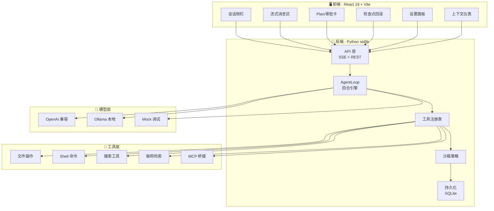

# Spark Agent

<div align="center">

一个**本地自托管**的 AI 编程 Agent，代码在你手，密钥在你手。

[](https://www.python.org/)
[](tests/)
[](LICENSE)
[]()
[](web/)


**[文档](docs/ARCHITECTURE.md)** · **[配置参考](docs/CONFIGURATION.md)** · **[贡献指南](CONTRIBUTING.md)**

</div>

```
       ⚡ 本地 · 可审计 · 长会话记忆 · 沙箱四档
```

## 开箱即用

```bash
# 1. 安装
git clone https://gitcode.com/badhope/spark.git
cd spark
python3 -m venv .venv && source .venv/bin/activate
pip install -e ".[dev]"

# 2. 配置模型密钥（写进 ~/.spark/config.toml 或环境变量）
cp .env.example .env.local
# 填写 SPARK_API_KEY / SPARK_BASE_URL / SPARK_MODEL

# 3. 启动 Web UI（推荐）
spark web --approval full-auto --workdir /your/project
# → http://localhost:8000
```

**Web UI 特性：** SSE 流式渲染 · 计划卡片 · 工具审批流 · 多模型切换 · 上下文水位计 · 历史会话 · 一键回滚检查点 · 任务进度持久化 · 长期记忆搜索 · 多设备同步

**CLI 特性：** `spark exec` 无头执行 · `spark sessions` 会话管理 · `spark resume <id>` 恢复现场 · `spark test` 自测循环

## 为什么用 Spark

- 🔒 **完全本地**：无遥测、无云兜底。你决定让 AI 看到什么、做什么
- 🧠 **记忆系统**：跨会话记住你的项目结构、偏好、习惯。越用越懂你
- 🔬 **沙箱四档**：sandbox-only → workspace → full-access → unrestricted，按风险灵活放开
- ⏮️ **回滚到任一检查点**：像 Git 一样回到之前的代码状态
- 🧰 **内置丰富工具**：read/write/patch、grep/glob、shell、Jupyter、Web 检索、Task 并行子 Agent
- 🌐 **MCP 兼容**：接入 Claude MCP 生态，轻松对接各种数据源
- 🧭 **多模型档案**：DeepSeek、OpenAI、Ollama 本地模型，一键切换
- 📊 **上下文可视化**：Token 水位实时显示，知道什么时候在极限附近

## 快速开始

### 交互式 Terminal UI

```bash
spark --workdir /path/to/project
```

进入 TUI 后直接输入自然语言指令，AI 会：
- 分析需求 → 制定计划 → 调用工具执行
- 遇到敏感操作（写文件、执行命令）时自动询问
- 执行完毕汇报结果

### Web UI（浏览器交互）

```bash
spark web --approval full-auto --workdir /workspace
```

浏览器打开 `http://localhost:8000`，支持：
- 流式消息渲染（打字机效果）
- 图片附件上传
- 实时任务计划展示
- 一键回滚检查点
- 多会话并行管理

### 批量执行（CI/CD）

```bash
spark exec --approval full-auto --model deepseek-chat "为这个 Python 项目写测试用例"
```

## 核心能力

### 工具清单

| 类别 | 工具 | 说明 |
|------|------|------|
| 文件 | `read_file` / `write_file` / `apply_patch` | 读写、局部替换 |
| 搜索 | `grep` / `glob` | 正则搜索、文件名匹配 |
| 执行 | `run_shell` / `bg_start` / `bg_output` / `bg_kill` | 命令行、后台任务（跨重启可查） |
| Git | `git_status` / `git_diff` / `git_log` / `git_branch` / `git_add` / `git_commit` | 仓库查看与提交（push 等高危操作留给用户） |
| 数据 | `read_notebook` / `notebook_edit` | Jupyter 操作 |
| 联网 | `web_search` / `web_fetch` | Bing 搜索、页面抓取 |
| 规划 | `update_plan` | 多步骤任务计划 |
| 扩展 | `task` / MCP 工具 | 子 Agent（最多 4 个并行）、外部桥接 |

### 沙箱权限

| 模式 | 说明 |
|------|------|
| `sandbox-only` | 仅允许 list_dir / read_file / glob / grep |
| `workspace` | + write_file / apply_patch / shell（默认） |
| `full-access` | + 后台任务 / MCP / 所有只读工具 |
| `unrestricted` | 关闭全部防护 |

### 记忆系统

1. **AGENTS.md**：注入项目级上下文（架构说明、工作流约定）
2. **长期记忆**：自动抽取关键事实，跨会话复用
3. **会话标题**：根据首条用户消息自动生成
4. **关键词标签**：语义聚类生成

## 多模型支持

```toml
# ~/.spark/config.toml

[provider]
name = "openai_compat"
base_url = "https://api.deepseek.com/v1"
model = "deepseek-chat"
api_key_env = "SPARK_API_KEY"

# 或切换本地 Ollama
[provider]
name = "ollama"
base_url = "http://localhost:11434/v1"
model = "deepseek-r1:7b"
```

支持格式：OpenAI Chat Completions、Ollama、Mock。可添加自定义 Provider。

## 配置参考

| 路径 | 用途 |
|------|------|
| `~/.spark/config.toml` | 全局配置（模型、权限、MCP） |
| `.spark.toml` | 项目级覆盖 |
| `AGENTS.md` | 项目上下文（agent 提示词注入） |
| `.memory/` | 长期记忆存储 |
| `~/.spark/sessions.db` | 会话持久化 |
| `~/.spark/checkpoints/` | 检查点快照目录 |

完整配置说明 → [docs/CONFIGURATION.md](docs/CONFIGURATION.md)

## 架构概览



详细架构图 → [docs/ARCHITECTURE.md](docs/ARCHITECTURE.md)

## 开发指南

```bash
# 运行测试
python3 -m pytest

# 前端类型检查
cd web && npx tsc -b

# 启动开发服务
npm run dev
```

## License

MIT License — 自由使用、修改、分发。

## 相关项目

- [OpenAI Codex](https://github.com/openai/codex) — 启发 Agent Loop 设计
- [Claude Code](https://claude.ai/code) — 启发本地 CLI 体验
- [MCP (Model Context Protocol)](https://modelcontextprotocol.io) — 工具扩展生态

---

**Built by [badhope](https://gitcode.com/badhope)** · 代码在你手，思考在你控。
