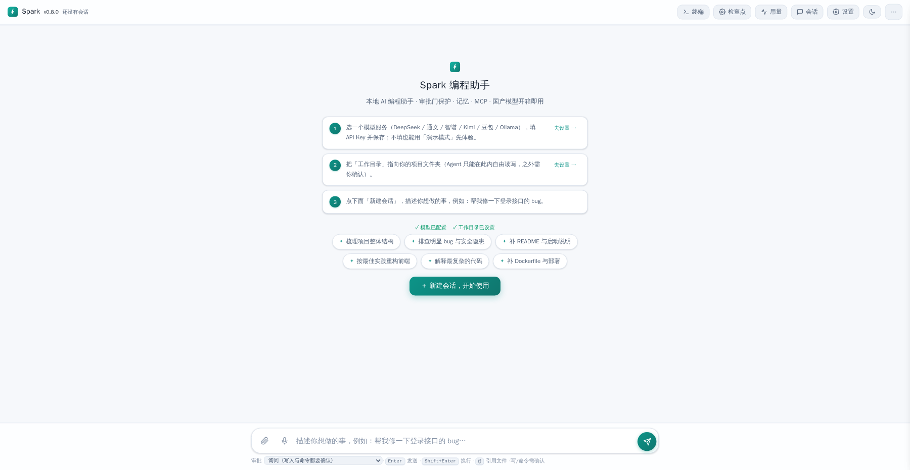
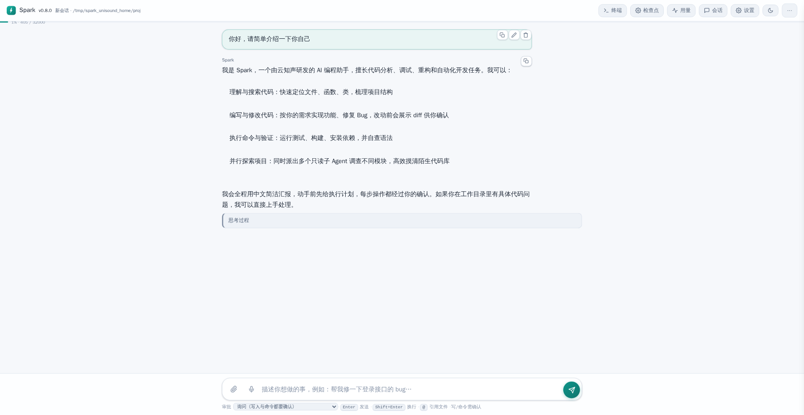
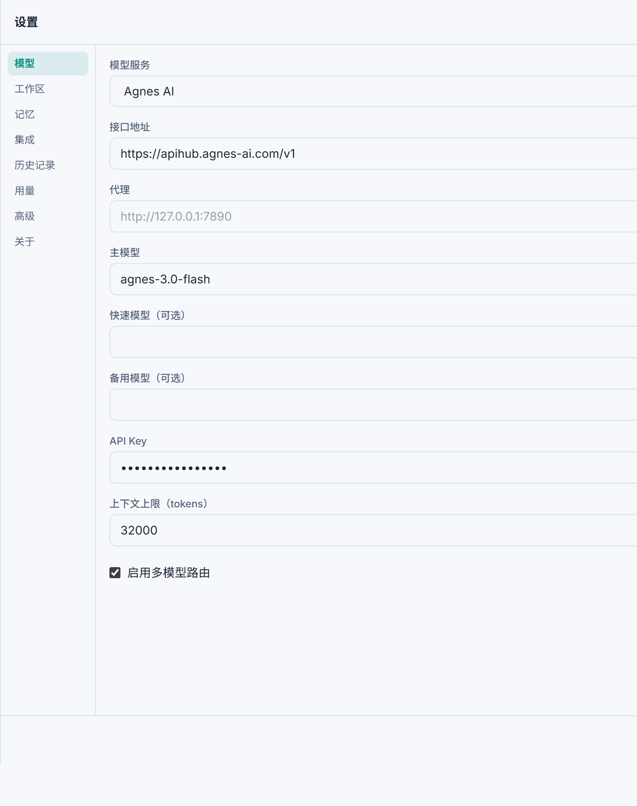
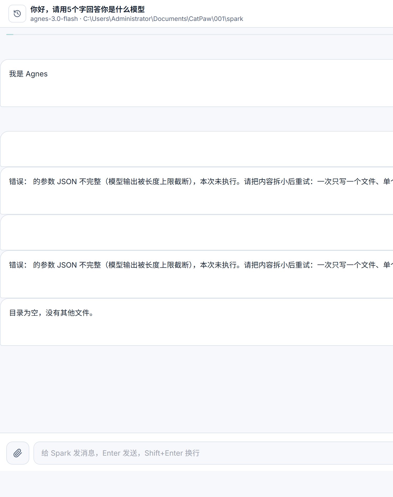
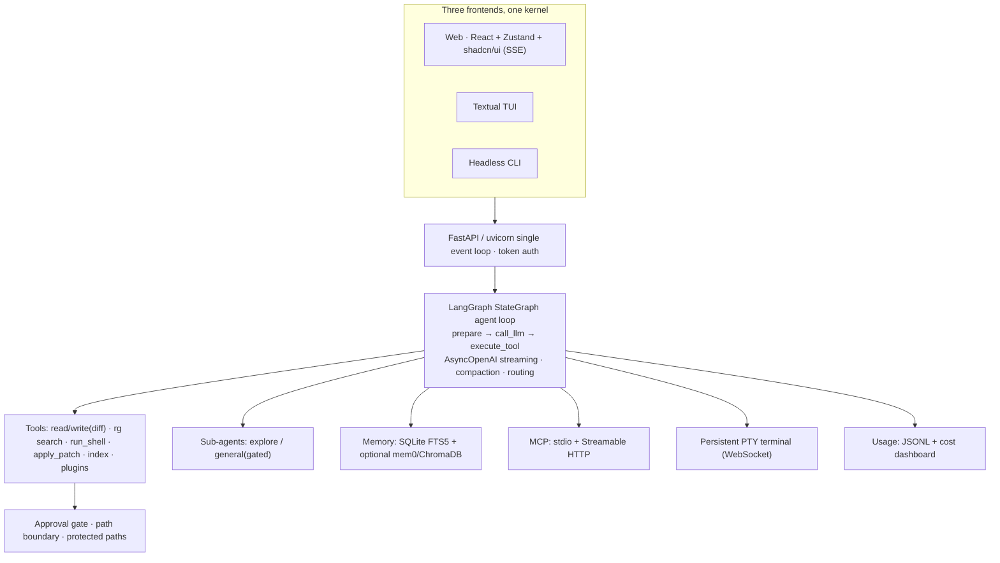

<!--
Spark: a local-first AI coding agent. Approval-gated writes & commands,
prompt-injection flagging via output-sandboxing + pattern detection,
local memory with optional vector backend (mem0 + ChromaDB),
MCP, Chinese model presets + Agnes AI, SSE streaming,
LangGraph-based agent loop, pydantic-settings config, Zustand + shadcn/ui frontend.
-->

<div align="center">

<picture>
  <source media="(prefers-color-scheme: dark)" srcset="assets/logo.svg">
  
</picture>

# ⚡ Spark

**The local AI coding agent that asks before it acts.**

Runs on your machine · Approves every write & command · Zero hidden model calls

[](LICENSE)
[]()
[](tests/)

**English** · [中文](README.zh.md)

</div>

---

Spark is a **local-first AI coding agent** — no Electron, no cloud dependency, no hidden model calls.

- **Approval gate**: nothing writes to disk or runs a command without your say-so (3 modes, path-boundary enforced).
- **Prompt-injection flagging**: every tool/file result is treated as untrusted data; known CN/EN injection patterns get an inline warning banner.
- **Local memory**: per-workdir storage with optional semantic search (mem0 + ChromaDB fallback); zero hidden AI calls for memory extraction.
- **Chinese models + global gateways**: DeepSeek / Qwen / ZhipuGLM / Kimi / Doubao / Ollama / Agnes AI presets, kept current for 2026 models.
- **Modern runtime**: LangGraph StateGraph agent loop, AsyncOpenAI streaming, pydantic-settings config validation.
- **Polished UI**: Zustand state, shadcn/ui components, assistant-ui chat primitives, marked markdown rendering.

One `pip install`, everything under `~/.spark/`.

---

## 🎬 See it in action

| | |
| --- | --- |
|  |  |
| Sidebar with session list + onboarding prompts | Real streaming conversation · Agnes-3.0-flash executing tools |
|  |  |
| Model preset & API configuration | Session management with fork / export / delete |

> Screenshots captured live against a running Agnes AI backend (apihub.agnes-ai.com, model `agnes-3.0-flash`). Reproduce them with: `powershell -File scripts/screenshot-demo.ps1`

---

## 🚀 Quick start

### Automated (one-shot)

```powershell
# Windows PowerShell — auto-starts backend + frontend, verifies health
powershell -ExecutionPolicy Bypass -File scripts/start-spark.ps1
```

### Manual

```bash
pip install -e ".[dev]"     # pulls uvicorn[standard] for WebSocket terminal
spark web --host 127.0.0.1 --port 8000
# In another terminal: cd spark/web && npm run dev
# Frontend at http://localhost:5173, backend at http://127.0.0.1:8000
```

The first launch auto-builds the frontend if `spark/web/dist/` is missing (node/npm required). To build manually:

```bash
cd spark/web && npm install && npm run build
```

**No API key?** Pick *Demo mode* in Settings — full interaction (plans, tool cards, approval prompts) works without a provider.

**Configure Agnes AI (or any custom provider):**
1. Open Settings → Model
2. Select preset "Agnes AI" or set Custom with base URL `https://apihub.agnes-ai.com/v1`
3. Enter your API key
4. Click "Test connection" — Spark will verify the endpoint before saving

**Headless:** `spark run "refactor lib.py" --workdir ./project`
**Terminal UI:** `spark tui` — keyboard-first (Ctrl+N new / Ctrl+S sessions / A allow / D deny)
**Health check:** `spark doctor`

## 📦 One-file binaries

Need a Windows EXE or macOS / Linux binary? Grab one from Releases, or build locally:

| Platform | Command | Output |
| --- | --- | --- |
| Windows | `scripts/build-windows.ps1` | `dist\spark\spark.exe` |
| Linux / macOS | `bash scripts/build.sh` | `dist/spark/spark` |

Full guide: [docs/INSTALL.md](docs/INSTALL.md)

## ✨ Approval gate (Spark's core differentiator)

Every write and every shell command goes through the gate:

| Mode | Writes | Commands |
| --- | --- | --- |
| `suggest` (default) | Always ask | Always ask |
| `auto-edit` | Trusted inside workdir | Always ask |
| `full-auto` | Trusted inside workdir | Trusted |

Two rules are **never** overridden by any mode or "always allow":

1. **Writes to protected paths** (e.g. `.git/`, `credentials.json`) → always denied
2. **Writes outside workdir** → always ask

## 🧰 What's inside (v0.9.0)

- **Multi-file edits (`apply_patch`)** — one unified diff across many files, grouped per-file review, all-or-nothing apply, git checkpoint rollback
- **Built-in persistent PTY** — xterm.js terminal, cwd = workdir, survives fold/refresh, multi-tab
- **Sub-agents** — `explore` (read-only scout) and `general` (full tools, still gated), events embedded in the main stream
- **Session fork & parallel runs** — branch a session at any point; run many concurrently with live status badges
- **Code search** — Python symbol + line extraction via stdlib `ast`; other languages line-level. Cached per-workdir, mtime+size invalidation, read-only
- **Lightweight plugins** — drop a `.py` into `~/.spark/plugins/`; plugin tools respect the gate; plugin failures never crash the server
- **Cost dashboard** — per-session token/fee JSONL; session ranking; pricing verified 2026, user-overridable
- **MCP** — official SDK, stdio + Streamable HTTP; read-only auto-pass, writes go through the gate
- **LangGraph agent loop** — agent runtime formalized as `StateGraph` (prepare → call_llm → execute_tool nodes); declarative edges replace hand-rolled while loop
- **Semantic memory (optional)** — mem0 + ChromaDB backend for vector search; falls back to SQLite FTS5 if unavailable
- **Everything local** — sessions `~/.spark/sessions/`, memory `~/.spark/memory/`, usage `~/.spark/usage/`, index `~/.spark/codeindex/`; JSONL, human-readable, deletable

## 🏗️ Architecture


```mermaid
flowchart TB
    subgraph UI["Three frontends, one kernel"]
        WEB["Web · React + Zustand + shadcn/ui (SSE)"]
        TUI["Textual TUI"]
        CLI["Headless CLI"]
    end
    UI --> API["FastAPI / uvicorn single event loop · token auth"]
    API --> LOOP["LangGraph StateGraph agent loop<br/>prepare → call_llm → execute_tool<br/>AsyncOpenAI streaming · compaction · routing"]
    LOOP --> TOOLS["Tools: read/write(diff) · rg search · run_shell · apply_patch · index · plugins"]
    LOOP --> SUB["Sub-agents: explore / general(gated)"]
    LOOP --> MEM["Memory: SQLite FTS5 + optional mem0/ChromaDB"]
    LOOP --> MCP["MCP: stdio + Streamable HTTP"]
    LOOP --> PTY["Persistent PTY terminal (WebSocket)"]
    LOOP --> USAGE["Usage: JSONL + cost dashboard"]
    TOOLS --> GATE["Approval gate · path boundary · protected paths"]
```

## 📁 Repo layout

```
spark/
  config.py       pydantic-settings · tomlkit · CN model presets · Agnes AI
  provider.py     AsyncOpenAI streaming · mock fallback · token estimate · retry
  approval.py     approval gate (path boundary always wins)
  loop.py         LangGraph StateGraph agent loop (nodes · edges · events)
  memory.py       SQLite FTS5 + optional mem0/ChromaDB vector backend
  compaction.py   fold-to-summary · langchain trim_messages · strip_orphans
  routing.py      semantic-router embedding routes · keyword fallback
  tui.py          Textual terminal UI
  tools/          fs / shell / plan / git / memory / mcp / injection / registry
  web/            FastAPI server + React frontend (bundled to single-file dist)
  cli.py          entry: web / run / doctor / config / memory / tui
examples/plugins/ sample plugins (time / text / loc tools)
tests/           256 pytest cases + 1 e2e harness
scripts/         start-spark.ps1 · screenshot-demo.ps1 · build scripts
```

## ✅ Tests

```bash
python3 -m pytest -q         # 256 tests — approval, tools, loop, memory, injection,
                             #   checkpoints, web API, MCP (stdio + HTTP), TUI, provider
python3 tests/e2e_manual.py  # real-uvicorn E2E — in-stream approval, 409, disk writes
```

## 📚 Documentation

| | 中文 | English |
| --- | --- | --- |
| Install & build | [docs/INSTALL.md](docs/INSTALL.md) | [docs/en/INSTALL.md](docs/en/INSTALL.md) |
| Configuration | [docs/CONFIG.md](docs/CONFIG.md) | [docs/en/CONFIG.md](docs/en/CONFIG.md) |
| HTTP API | [docs/API.md](docs/API.md) | [docs/en/API.md](docs/en/API.md) |
| Architecture | [docs/ARCHITECTURE.md](docs/ARCHITECTURE.md) | [docs/en/ARCHITECTURE.md](docs/en/ARCHITECTURE.md) |

## 📄 License

MIT.

Built on: ripgrep · difflib · SQLite FTS5 · official `mcp` SDK · Textual · FastAPI ·
React · Zustand · shadcn/ui · assistant-ui · marked · LangGraph · mem0 · ChromaDB ·
pydantic-settings · semantic-router · AsyncOpenAI.
