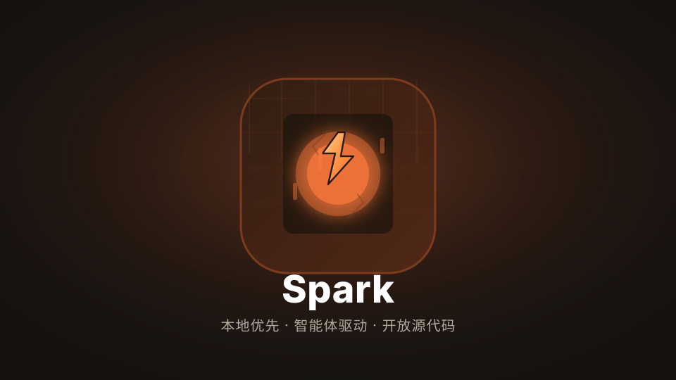
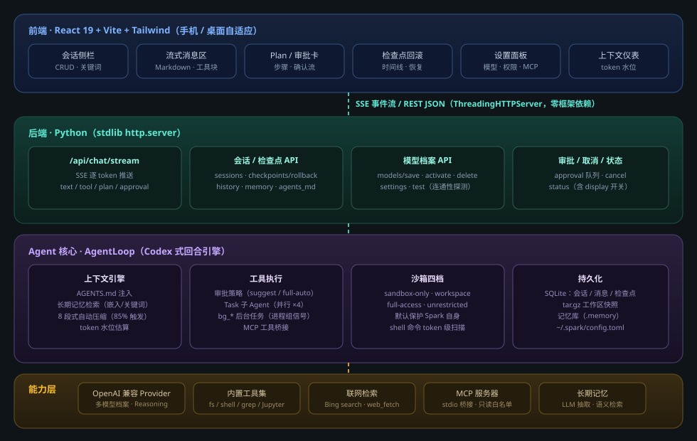

> 🌐 [English](README.md) | [中文](README_zh.md)

# Spark — Local-first AI Coding Agent

[](https://opensource.org/licenses/MIT)
[](https://www.python.org/)
[](https://nodejs.org/)

**Code stays with you. Keys stay with you.** A self-hosted AI coding assistant that runs entirely on your machine — zero privacy leaks, full control.

## Core Values

🔒 **Privacy First** — All code, conversation, and memory data stay entirely local. No third-party servers involved.  
⚡ **Ready in a Click** — Launch with one command, access via browser. Zero configuration overhead.  
🧠 **Persistent Memory** — Remembers your project preferences, naming conventions, and workflow habits.  
🔬 **Four-Level Sandbox** — From read-only analysis to full access, tunable by risk profile.  
⏮️ **Checkpoint & Rollback** — Jump to any previous state just like Git.

## Quick Start

```bash
git clone https://gitcode.com/badhope/spark
cd spark && python3 -m venv .venv && source .venv/bin/activate
pip install -e ".[dev]"
spark web --workdir /your/project
```

Open `http://localhost:8000` to start conversing.

## Preview



## Feature Overview

| Category | Features |
|----------|----------|
| Chat | SSE streaming render, Markdown code blocks, image attachment upload |
| Tools | File read/write, grep/glob search, Shell commands, Jupyter, Web Fetch |
| Planning | Multi-step task plans, parallel sub-Agent delegation (up to 4) |
| Permissions | Four-level sandbox, tool approval flow, protected path list |
| Memory | AGENTS.md injection, long-term memory retrieval, auto keyword tagging |
| Persistence | Session management, checkpoint & rollback, hot-reload configuration |
| Models | DeepSeek, OpenAI, Ollama local models, multi-profile switching |
| Extension | MCP protocol compatible, custom Provider, plugin-based tools |

## Architecture



Detailed architecture → [docs/ARCHITECTURE.md](docs/ARCHITECTURE.md)

## Platform Requirements

- Python 3.11+
- Node.js 18+ (frontend development only)
- Any OpenAI-compatible API (DeepSeek, OpenAI, Ollama, Azure, etc.)

## Community

- Contributing: [CONTRIBUTING.md](CONTRIBUTING.md)
- Configuration Reference: [docs/CONFIGURATION.md](docs/CONFIGURATION.md)
- Issue Tracker: [GitCode Issues](https://gitcode.com/badhope/spark/issues)

---

**License:** MIT · **Author:** badhope · **Built with ❤️ in Shenzhen**
