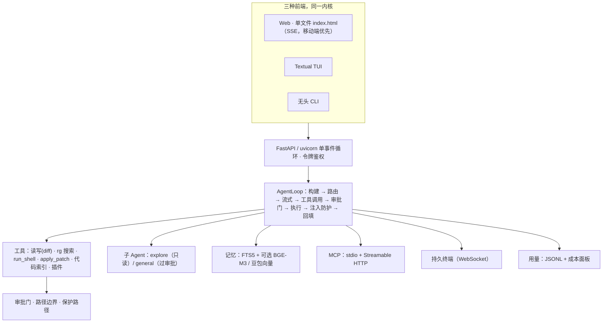

<div align="center">

# ⚡ Spark

**先征求你同意，才动手的本地 AI 编程助手。**

跑在你本机 · 每一步都看得见 · 写入与命令都要你点头 · 零隐性 AI 调用

[](LICENSE)
[]()
[]()

[English](README.md) · **中文**

</div>

---

Spark 是一个**本地优先的 AI 编程助手**，从零重写：无 Electron 臃肿、无云端依赖、无隐性模型调用。**审批门**保护你的项目（写文件、执行命令一律先征求同意），内置 **Prompt Injection 防护**，记忆**全部存本地**，国产模型（DeepSeek / 通义 / 智谱 / Kimi / 豆包 / Ollama）开箱即用。

单文件前端、单进程、一条 `pip install`，所有数据都在 `~/.spark2/`。

> ✨ **与 opencode / ZCode / Codex CLI 的差异**：这三者都没有内置的注入防护和跨会话语义记忆——Spark 两者都有，还带轻量插件点、本地代码索引和成本面板。

## 🚀 快速开始

```bash
cd spark2
pip install -e ".[dev]"
spark2 web          # 打开打印出的地址（仅监听 127.0.0.1）
```

1. 打开**设置** → 选模型服务（DeepSeek / 通义 / 智谱 / Kimi / 豆包 / Ollama / **演示模式**）→ 填 API Key → 把**工作目录**指向你的项目 → **保存**。
2. 点「**+ 新建会话**」描述需求，例如"帮我修一下登录接口的 bug"。
3. 全程可见：计划卡 → 工具卡 → diff 预览 → **你确认** → 结果。

**没有 API Key？** 把模型服务设为「演示模式」，完整交互（计划卡、工具卡、审批弹窗）零配置可用。

**无头模式**：`spark2 run "重构 lib.py" --workdir /path/to/project`
**终端界面**：`spark2 tui`（同一内核，Ctrl+N 新建 / Ctrl+S 会话 / A 允许 / D 拒绝 / S 始终允许）
**体检**：`spark2 doctor`（环境 / 配置 / MCP / 记忆 / 日志一条龙）

## 🧰 v0.8.0 功能一览

- 🛡️ **审批门** — 询问 / 自动编辑 / 全自动三档；保护路径永远拒绝；工作目录之外写入永远确认；会话内"始终允许"
- 🧠 **Prompt Injection 防护** — 工具/文件输出一律视为不可信数据，中英文注入特征检测并内联警告；权限永远由审批门决定
- 📦 **多文件编辑（apply_patch）** — 一次补丁改多个文件，按文件分组的 diff 审批（可展开/折叠），全有或全无，git 检查点可回滚
- 🖥️ **内置持久终端（PTY）** — xterm.js 面板，cwd=工作目录，折叠/刷新不杀进程，多 tab，随时接管输入
- 👥 **多 Agent（spawn_subagent）** — `explore` 只读调查员、`general` 全工具执行器（写操作**照样过审批门**）；事件嵌入主对话流；共享取消
- 🍴 **会话分叉与并行** — 任意节点复制成独立会话；多会话并行运行，实时"● 运行中"徽标
- 🔎 **代码索引** — `index_project` / `search_symbol` / `lint_file`：Python 标准库 ast 精确解析（符号+行号），其他语言行级提取；按工作目录缓存、mtime+size 失效、全只读
- 🧩 **轻量插件点** — 往 `~/.spark2/plugins/` 丢一个 `.py` 即可加工具（`tools=` 或 `register(reg)`）；插件工具照常过审批门；失败不影响主服务
- 💰 **成本面板** — 每次调用的 tokens/费用按会话落 JSONL；顶栏"用量"面板带会话排行；内置 2026-09 已核验官方价（DeepSeek 谷价 / 豆包方舟），可覆盖
- 🧠 **本地记忆** — 说"记住 XX 是 YY"即可；每轮 FTS5 本地检索（中文双字感知），可选语义（豆包向量 / 本地 BGE-M3 离线）；按工作目录隔离
- 🔌 **MCP** — 官方 SDK，stdio + Streamable HTTP（2026-07-28 规范）；只读放行、写入过审批
- 💾 **全本地** — 会话 / 记忆 / 用量 / 索引都在 `~/.spark2/`，JSONL 人可读、可审计、可删除

## 🏗️ 架构



## ✅ 测试

```bash
python3 -m pytest -q      # 103 个用例全绿
python3 tests/e2e_manual.py  # 真实 uvicorn 端到端（流内审批 / 409 / 落盘）
```

## 📄 许可证

MIT。站在开源巨人肩上——ripgrep、difflib、SQLite FTS5、官方 mcp SDK、Textual、FastAPI。不重复造轮子，无 SaaS 锁定。

---

**为喜欢"先问再动手、本地运行、不烧钱"的人而做。** 点 Star、Fork、插上你自己的工具——Spark 是你的。
