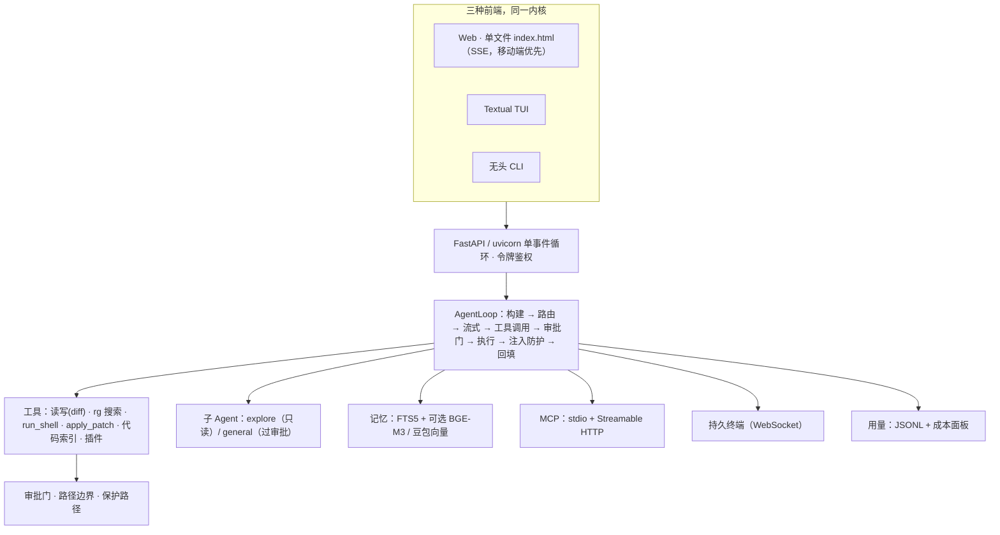
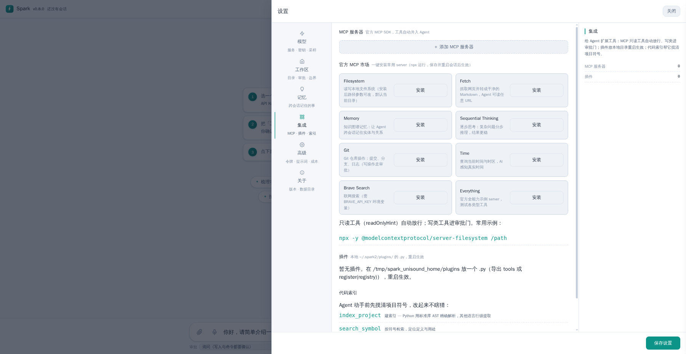

<div align="center">

# ⚡ Spark

**先征求你同意，才动手的本地 AI 编程助手。**

跑在你本机 · 每一步都看得见 · 写入与命令都要你点头 · 零隐性 AI 调用

[](LICENSE)
[]()
[](tests/)

[English](README.md) · **中文** · [日本語](README.ja.md) · [Español](README.es.md)

</div>

---

Spark 是一个**本地优先的 AI 编程助手**，从零重写：无 Electron 臃肿、无云端依赖、无隐性模型调用。**审批门**保护你的项目（写文件、执行命令一律先征求同意），工具/文件输出作**非信任数据**处理（已知中英文注入模式会触发行内警示），记忆**全部存本地**，国产模型（DeepSeek / 通义 / 智谱 / Kimi / 豆包 / 云知声 / Ollama）开箱即用。

单文件前端、单进程、一条 `pip install`，所有数据都在 `~/.spark/`。

## 🚀 快速开始

 ```bash
 cd spark
 pip install -e ".[dev]"     # 依赖含 uvicorn[standard]（Web 终端 WS 必需）
 spark web          # 打开打印出的地址（默认监听 0.0.0.0，便于外部预览）
 ```

 > 若 `spark web` 的**终端面板**连不上（WS 404/不支持升级），多半是 uvicorn 缺 websockets：
 > `pip install "uvicorn[standard]"` 后重启。
 >
 > **pip 过旧：** 系统 pip < 23.2 时 `pip install -e ".[dev]"` 可能报 "No matching distribution
 > found for fastapi"，先 `python -m pip install --upgrade pip` 再装。
 >
 > **外部预览访问：** `spark web` 默认 `--host 0.0.0.0`，可被外部代理/预览服务访问；
 > 仅本机使用可显式传 `--host 127.0.0.1`。

## 📦 安装包（Windows EXE / macOS / Linux）

不想用 pip？到 **GitHub Releases** 下载现成包（`git tag v0.9.0 && git push --tags` 自动构建），
或一条命令本地打包：

| 平台 | 一条命令 | 产物 |
| --- | --- | --- |
| Windows | `powershell -ExecutionPolicy Bypass -File scripts/build-windows.ps1` | `dist\spark\spark.exe` |
| Linux / macOS | `bash scripts/build.sh` | `dist/spark/spark` |

`spark` 可执行文件内嵌 CLI **和** Web 界面（前端资源全打包）：
运行 `spark.exe web`（或 `./spark web`）后浏览器打开打印的地址。
完整指南：[docs/INSTALL.md](docs/INSTALL.md) · [docs/en/INSTALL.md](docs/en/INSTALL.md)

1. 打开**设置** → 选模型服务（DeepSeek / 通义 / 智谱 / Kimi / 豆包 / Ollama / **演示模式**）→ 填 API Key → 把**工作目录**指向你的项目 → **保存**。
2. 点「**+ 新建会话**」描述需求，例如"帮我修一下登录接口的 bug"。
3. 全程可见：计划卡 → 工具卡 → diff 预览 → **你确认** → 结果。

**没有 API Key？** 把模型服务设为「演示模式」，完整交互（计划卡、工具卡、审批弹窗）零配置可用。

**无头模式**：`spark run "重构 lib.py" --workdir /path/to/project`
**终端界面**：`spark tui`（同一内核，Ctrl+N 新建 / Ctrl+S 会话 / A 允许 / D 拒绝 / S 始终允许）
**体检**：`spark doctor`（环境 / 配置 / MCP / 记忆 / 日志一条龙）

## 🧰 v0.9.0 功能一览

- 🛡️ **审批门** — 询问 / 自动编辑 / 全自动三档；保护路径永远拒绝；工作目录之外写入永远确认；会话内"始终允许"
- 🧠 **Prompt Injection 防护** — 工具/文件输出一律视为不可信数据，中英文注入特征检测并内联警告；权限永远由审批门决定
- 📦 **多文件编辑（apply_patch）** — 一次补丁改多个文件，按文件分组的 diff 审批（可展开/折叠），全有或全无，git 检查点可回滚
- 🖥️ **内置持久终端（PTY）** — xterm.js 面板，cwd=工作目录，折叠/刷新不杀进程，多 tab，随时接管输入
- 👥 **多 Agent（spawn_subagent）** — `explore` 只读调查员、`general` 全工具执行器（写操作**照样过审批门**）；事件嵌入主对话流；共享取消
- 🍴 **会话分叉与并行** — 任意节点复制成独立会话；多会话并行运行，实时"● 运行中"徽标
- 🔎 **代码索引** — `index_project` / `search_symbol` / `lint_file`：Python 标准库 ast 精确解析（符号+行号），其他语言行级提取；按工作目录缓存、mtime+size 失效、全只读
- 🧩 **轻量插件点** — 往 `~/.spark/plugins/` 丢一个 `.py` 即可加工具（`tools=` 或 `register(reg)`）；插件工具照常过审批门；失败不影响主服务
- 💰 **成本面板** — 每次调用的 tokens/费用按会话落 JSONL；顶栏"用量"面板带会话排行；内置 2026-09 已核验官方价（DeepSeek 谷价 / 豆包方舟），可覆盖
- 🧠 **本地记忆** — 说"记住 XX 是 YY"即可；每轮 FTS5 本地检索（中文双字感知），可选语义（豆包向量 / 本地 BGE-M3 离线）；按工作目录隔离
- 🔌 **MCP** — 官方 SDK，stdio + Streamable HTTP（2026-07-28 规范）；只读放行、写入过审批
- 🌐 **联网工具** — `web_search`（Bing 解析）+ `read_url`（HTML 转纯文本），只读免审批，Agent 可查最新文档/报错
- 🔁 **模型容灾与路由** — `fallback_model` 主模型故障自动切换；`model_fast` 简单任务走快速模型（对标 Claude Code fallback）
- ✏️ **消息编辑重发** — 编辑任意用户消息 → 载入原文、截断会话、修改重发；删除消息持久生效
- 🔍 **会话全文搜索** — 标题/目录/消息正文全文命中，卡片显示匹配片段
- 📊 **上下文水位** — 会话页进度条 + 数字（已用/上限），超窗自动压缩
- 🎙️ **语音输入** — Web Speech 中文听写（不支持自动隐藏）
- 🛒 **MCP 市场** — 8 个官方 server 一键安装，进列表即生效
- 💾 **全本地** — 会话 / 记忆 / 用量 / 索引都在 `~/.spark/`，JSONL 人可读、可审计、可删除

## 🏗️ 架构


```mermaid
flowchart TB
    subgraph UI["三种前端，同一内核"]
        WEB["Web · 单文件 index.html（SSE，移动端优先）"]
        TUI["Textual TUI"]
        CLI["无头 CLI"]
    end
    UI --> API["FastAPI / uvicorn 单事件循环 · 令牌鉴权"]
    API --> LOOP["AgentLoop：构建 → 路由 → 流式 → 工具调用 → 审批门 → 执行 → 注入防护 → 回填"]
    LOOP --> TOOLS["工具：读写(diff) · rg 搜索 · run_shell · apply_patch · 代码索引 · 插件"]
    LOOP --> SUB["子 Agent：explore（只读）/ general（过审批）"]
    LOOP --> MEM["记忆：FTS5 + 可选 BGE-M3 / 豆包向量"]
    LOOP --> MCP["MCP：stdio + Streamable HTTP"]
    LOOP --> PTY["持久终端（WebSocket）"]
    LOOP --> USAGE["用量：JSONL + 成本面板"]
    TOOLS --> GATE["审批门 · 路径边界 · 保护路径"]
```

## ✅ 测试

```bash
python3 -m pytest -q      # 227 个用例（审批/工具/循环/记忆/注入/检查点/Web API/MCP/TUI/斜杠命令/设置契约）
python3 tests/e2e_manual.py  # 真实 uvicorn 端到端（流内审批 / 409 / 落盘）
```

## 界面预览

| | |
| --- | --- |
|  |  |
|  |  |
|  | |

## 📚 文档（中文 / English）

| | 中文 | English |
| --- | --- | --- |
| 安装与打包（Windows EXE） | [docs/INSTALL.md](docs/INSTALL.md) | [docs/en/INSTALL.md](docs/en/INSTALL.md) |
| 配置参考 | [docs/CONFIG.md](docs/CONFIG.md) | [docs/en/CONFIG.md](docs/en/CONFIG.md) |
| HTTP API | [docs/API.md](docs/API.md) | [docs/en/API.md](docs/en/API.md) |
| 架构说明 | [docs/ARCHITECTURE.md](docs/ARCHITECTURE.md) | [docs/en/ARCHITECTURE.md](docs/en/ARCHITECTURE.md) |
| 文档索引 | [docs/README.md](docs/README.md) | [docs/en/](../docs/en/) |


- `docs/CONFIG.md` — 配置文件全字段说明（config.toml）
- `docs/API.md` — HTTP API 参考（SSE 事件 / 会话 / 配置 / 记忆）
- `docs/ARCHITECTURE.md` — 架构与数据流 / 安全模型
- `examples/config.toml.example` — 配置示例
- `examples/plugins/` — 插件示例

## 📄 许可证

MIT。站在开源巨人肩上——ripgrep、difflib、SQLite FTS5、官方 mcp SDK、Textual、FastAPI。不重复造轮子，无 SaaS 锁定。

---

**为喜欢"先问再动手、本地运行、不烧钱"的人而做。** 点 Star、Fork、插上你自己的工具——Spark 是你的。

> AI生成
