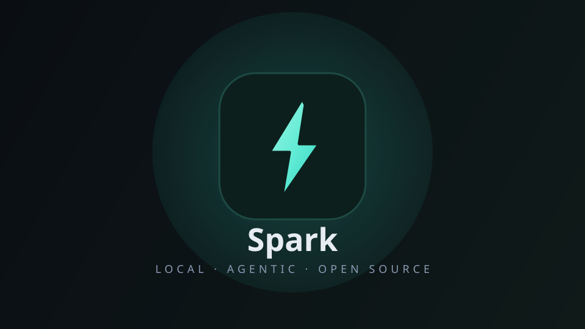
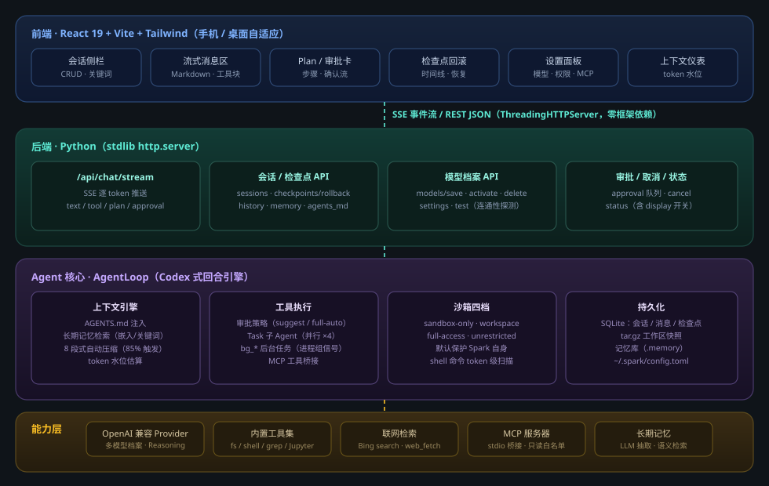

# Spark Agent

Spark 是一个**本地自托管**的 AI 编程 Agent，代码在你手，密钥在你手。

**一句话介绍：** 把 Claude Code 的能力装进你的本地环境，零隐私泄露，完全可控。

## 核心价值

🔒 **隐私至上** — 所有代码、对话、记忆全部存本地，不经过任何第三方服务器  
⚡ **即开即用** — 一键启动 Web UI，浏览器直接操作，无需配置  
🧠 **长程记忆** — 记住你的项目偏好、命名规范、工作流习惯  
🔬 **四档沙箱** — 从只读分析到完全开放，按风险灵活调整  
⏮️ **检查点回滚** — 像 Git 一样回到任意时刻的代码状态  

## 快速开始

```bash
git clone https://gitcode.com/badhope/spark
cd spark && python3 -m venv .venv && source .venv/bin/activate
pip install -e ".[dev]"
spark web --workdir /your/project
```

打开 `http://localhost:8000` 开始对话。

## 截图预览



## 特性一览

| 类别 | 功能 |
|------|------|
| 对话 | SSE 流式渲染、Markdown 代码块、图片附件上传 |
| 工具 | 读写文件、grep/glob 搜索、Shell 命令、Jupyter、Web 检索 |
| 规划 | 多步骤任务计划、子 Agent 并行委派（最多 4 个） |
| 权限 | 四档沙箱、工具审批流、路径保护清单 |
| 记忆 | AGENTS.md 注入、长期记忆检索、自动关键词标签 |
| 持久化 | 会话管理、检查点回滚、配置热加载 |
| 模型 | DeepSeek、OpenAI、Ollama 本地模型、多档案切换 |
| 扩展 | MCP 协议兼容、自定义 Provider、插件化工具 |

## 架构



详细架构说明 → [docs/ARCHITECTURE.md](docs/ARCHITECTURE.md)

## 支持的平台

- Python 3.11+
- Node.js 18+（仅前端开发）
- 任意 OpenAI 兼容 API（DeepSeek、OpenAI、Ollama、Azure 等）

## 社区

- 贡献指南：[CONTRIBUTING.md](CONTRIBUTING.md)
- 配置参考：[docs/CONFIGURATION.md](docs/CONFIGURATION.md)
- 问题反馈：[GitCode Issues](https://gitcode.com/badhope/spark/issues)

---

**License:** MIT · **作者:** badhope · **Built with ❤️ in Shenzhen**
